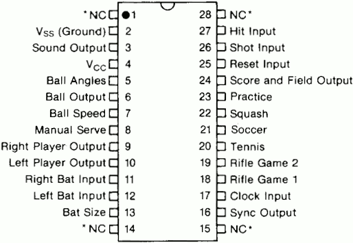

# RGB modification for AY-3-8500 based game consoles

## Problems without an rgb output

The [AY-3-8500](https://en.wikipedia.org/wiki/AY-3-8500) is an integrated circuit from the 1970's used in pong-like video gaming consoles.
These consoles have an antenna output where the video signal is modulated onto a VHF channel.
The video quality is very poor because of the nature of a composite video and the VHF back and forth conversion.

Some consoles have a colored output where the playing field, the ball and the left and right paddle have different colors. This is possible because the AY-3-8500 provides separate signals for them.
A curcuit of logic gates generates different phased color carriers and combies each picture signal with one of them in order to get the colored output.
The color generation is very simple and the resulting composite video signal might not be completely compatible with the standards.
A wrong adjusted color carrier frequency might also lead to a TV not showing the colors at all and fall back to a b/w video.
 
Now there are modifications for having a composite video output for such consoles like 
[this one](https://circuit-board.de/forum/index.php/Thread/11658-Umbau-von-Universum-4106-Color-Video-Out/). 
Though this already provides better video quality as the HF conversion is skipped, the quality and stability of the video is still not perfect.

Composite video signals have - in contrast to rgb - a systematic problem: luminance and color signals disturb each other. Aka [dot crawl](https://en.wikipedia.org/wiki/Dot_crawl).

In my case, i got a UNIVERSUM Multi Color Spiel 4106 with PAL color output and wanted to connect it to a modern flat screen TV which did not show the colors correctly. You might also use this rgb mod to add colored output if your console is just black/white.

## The RGB modification

### AY-3 signals

The AY-3-8500 has this pinout:

.
 
It works with 6...7V. In my case a voltage regulator will limit battery voltage to 6.1V.

We need to connect to these pins:

| signal                         |  pin  |
|--------------------------------|-------|
| Vss (ground)                   |  2    |
| Sound output                   |  3    |
| Vcc (6.1V)                     |  4    |
| Ball output                    |  6    |
| Right player output            |  9    |
| Left player output             |  10   |
| Sync output                    |  16   |
| Score and Field output         |  24   |

All signals are active high (high voltage == bright).

### Color mapping

I decided to map the four signals to the red, green, blue inputs like this:

|          |   ball   | score & field  |  left    |  right   |
|----------|----------|----------------|----------|----------|
| red      |    x     |      x         |    x     |          |
| green    |    x     |      x         |          |    x     |
| blue     |    x     |                |    x     |    x     |
|----------|----------|----------------|----------|----------|
| color    |  white   |     yellow     |  purple  | sky blue |

### SCART signals

I decided to interface to a [SCART connector](https://en.wikipedia.org/wiki/SCART) which provides rgb input on a TV - at least in europe.

| signal                         |  pin  |  remark                       |
|--------------------------------|-------|-------------------------------|
| red video                      |  15   |  0.7 Vpp, 75 ohms             |
| green video                    |  11   |  0.7 Vpp, 75 ohms             |
| blue  video                    |  7    |  0.7 Vpp, 75 ohms             |
| RGB video selection            |  16   |  0..0.4V=composite, 1..3V=RGB |
| composite video                |  20   |  1 Vpp, 75 ohms               |
| audio input                    |  2+6  |  0.40 mVrms, > 47K ohms       |
| GND signals 14, 7,18,5,9,13    |       |                               |

### Circuit

The AY-3-8500 signals are TTL (more precisely the supply voltage of AY - may be 6..9V).
The 74HC4075 (3-input OR gates) does the color mapping and can work directly with the AY signals.
Output current of 74HC is too weak to drive a 75Ohms video out so we need to amplify.
A npn transistor is used as emitter follower to amplify the current (not the voltage).
After T1-T3, we have VCC-0,7V. Video out has 1V max.
After T4 we need 0...0.3V for sync levels. 

The audio signal is actually not needed when the console itself has a built-in speaker.
Anyway it is fun to hear how the picture processing delays audio on a modern flat TV. Note that lightguns work only on 50/60Hz crt TVs, not on modern ones.
The circuit provies a jumper for audio on/off.

The composite video is needed on the SCART connector for sync even if it may be present in the rgb signals. A TV takes extracts sync information from the composite video pin. If pin 16 is 1..3V the rgb input is selected and any picture information on pin 19 is ignored.
I originally tried to re-use the already present composite signal which is generated inside the game console. But this signal turned out to generate unstable picture on some TVs as it is very high resistive and grabbing it may influence internal signal leves too much.
Anyhow, if the sync info is taken directly from AY, we do not use any other signal from the console which means, one can actually build up the whole game system just with the AY and some paddles/switches.

When only signals from the AY are taken, one can make such a intermediate socket which can be inserted into the console without soldering.

And here is the schematic

The 1kOhms R7 pull up is needed because the consoles internal circuitry loads the AY's ball pin too much the resulting level the 74HC did not recognize as low.

For T1,T2,T3 almost any bipolar npn type should do the job.
Note: A BC547 has pin out C-B-E but on the board the C is in the middle. It just was easier to route. You need to cross the pins.

The schematic and the board are made with the free version 9.3.2 of [AUTODESK EAGLE](https://www.autodesk.com/products/eagle/free-download)

### Photos

Original console's video signal quality with just the composite mod (quality of the antenna signal is even worse). One can see the dot crawl and some background noise.

After the rgb mod

board

### Good luck

I like to know when you build this rgb mod, please drop me a mail. Also any other feedback is welcome.

Greetings go to my very good friend Sven.

Happy retro gaming! 

### other retro game projects

[Siemens BILDMEISTER Turnier FZ 2001 video modification](bildmeister.md)
